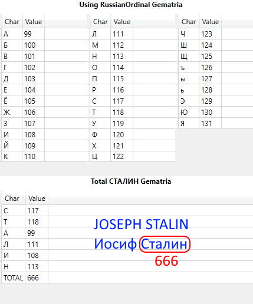
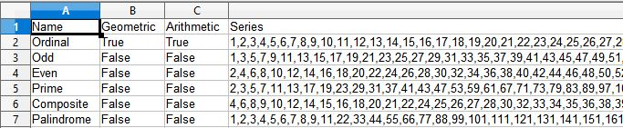

# Gematria Calculator
#### AntiChrist Finder - Number of the Beast - Who Is 666

<em>Rev 13:18 This calls for wisdom. Let the person who has insight calculate the number of the beast, for it is the number of a man. That number is 666.</em>

This calculator will help you find the gematria number for human name and suggest the correct gematria system for it. 
Language supported: English, Russian, Japanese, Greek and Hebrew. 

### Example of Gematria

Adolf Hitler

Joseph Stalin

Benito Mussolini

### Download Installer

To download the MSI installer please download it under ['GematriaSetup'](https://github.com/dannypeanuts/GematriaCalculator/blob/main/GematriaSetup) folder or click [HERE](https://github.com/dannypeanuts/GematriaCalculator/blob/main/GematriaSetup/Release/GematriaSetup.msi).

### How Does It Works

Gematria is basically assigning an alphabet system with a numeric system within any valid human language. 

The alphabet could be any valid alphabet system from different language or keyboard sequence etc. 

And the sequence could be any valid numeric system such as simple arithmetic/geometric sequence, prime series, etc.

You are welcome to modify these CSV configuration file to support more language, alphabet and numeric system which is located under ['Data'](https://github.com/dannypeanuts/GematriaCalculator/blob/main/Data) folder.

### Coding Requirement

1. Visual Studio 2019 
   - Extension Required: MS VS Installer Projects
2. Dot Net Framework 3.1
3. WPF Framework
4. C# Programming Language
5. Any Git Client

